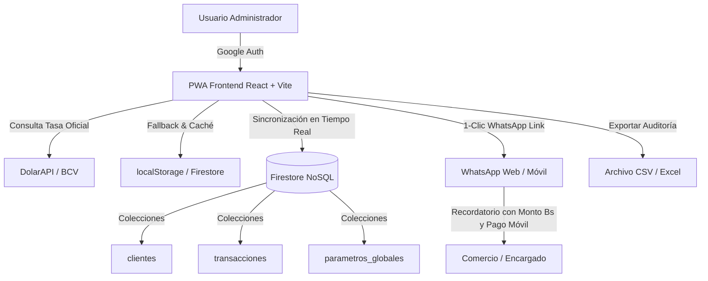

<div align="center">

# 💼 CRM Multi-Suscripciones (PWA)
### Control Inteligente de Cobranza Recurrente a Negocios Locales

[](https://react.dev/)
[](https://vitejs.dev/)
[](https://tailwindcss.com/)
[](https://firebase.google.com/)
[](https://crm-multisuscriptores.web.app)
[](LICENSE)

<p align="center">
  <b>Panel administrativo interno (Admin-Only) de alto rendimiento para supervisar métricas, morosidad y proyecciones financieras de comercios suscritos (bodegas, gimnasios, tiendas) en Venezuela.</b>
</p>

[🌐 Ver Aplicación en Producción](https://crm-multisuscriptores.web.app) • [🔥 Consola Firebase](https://console.firebase.google.com/project/crm-multisuscriptores/overview) • [👨‍💻 Desarrollador](https://oman-vasquez.web.app)

---

</div>

## 📖 Tabla de Contenidos
- [Visión General](#-visión-general)
- [Arquitectura del Sistema](#-arquitectura-del-sistema)
- [Características Principales](#-características-principales)
- [Modelo de Datos (Firestore NoSQL)](#-modelo-de-datos-firestore-nosql)
- [Automatización de Cobranza (WhatsApp & Pago Móvil)](#-automatización-de-cobranza-whatsapp--pago-móvil)
- [Stack Tecnológico](#-stack-tecnológico)
- [Instalación y Configuración Local](#-instalación-y-configuración-local)
- [Despliegue en Firebase Hosting](#-despliegue-en-firebase-hosting)
- [Seguridad Crítica y Reglas](#-seguridad-crítica-y-reglas)
- [Autor y Créditos](#-autor-y-créditos)

---

## 🎯 Visión General

El **CRM Multi-Suscripciones** es una Progressive Web App (PWA) diseñada con enfoque **Mobile-First** para operar tanto en laptops (entorno Linux / ChromeOS Flex) como directamente desde smartphones mientras se realizan visitas comerciales en la calle.

### Principios Fundamentales:
* **Admin-Only:** No es un portal para clientes ni requiere registro abierto; es el centro de comando personal del administrador.
* **Cobro Manual en Bolívares (VES):** Las tarifas se fijan en USD pero se cobran y calculan en tiempo real a la tasa oficial del BCV del día.
* **Cero Scraping Frágil:** Integración formal con **DolarAPI** con tolerancia a fallos mediante caché local y edición manual de contingencia.
* **Integridad Garantizada:** Prohibido el borrado físico de clientes (`Soft Delete`), asegurando auditoría inmutable de pagos.

---

## 🏛 Arquitectura del Sistema



---

## ✨ Características Principales

### 1. 📊 Dashboard Financiero de 4 KPIs en Tiempo Real
* **Clientes Activos:** Contador global de comercios actualmente operativos.
* **Semáforo de Morosidad:** Monitor visual instantáneo que separa los clientes **Solventes** (verde) de los **Morosos** (rojo) según la fecha de corte.
* **Proyección Mensual:** Estimación total de facturación en **USD** y su equivalente exacto en **Bs. a tasa BCV**.
* **Recaudado en el Mes:** Registro acumulado de ingresos efectivamente cobrados durante el mes en curso.

### 2. 💵 Integración Oficial con Tasa BCV
* Consulta automatizada al endpoint oficial `GET https://ve.dolarapi.com/v1/dolares/oficial`.
* **Caché Híbrido:** Si estás en la calle con conexión intermitente, la app lee la última tasa guardada en `localStorage` o en Firestore.
* **Modal de Fallback Manual:** Permite ajustar la tasa de cambio en un clic si la API está fuera de línea o si sube la tasa oficial del día.

### 3. 🏷️ Filtros y Búsqueda Dinámica
* **Filtro de Aplicaciones Inteligente:** Extrae dinámicamente las categorías únicas presentes en la base de datos (ej. `BodegasPro`, `GymControl`, `FacturaFácil`), **sin valores quemados en código**.
* **Filtro de Estado:** Alterna en un clic entre *Todos*, *Morosos* y *Solventes*.
* **Búsqueda Reactiva:** Encuentra al instante clientes por nombre de negocio, encargado, cédula o teléfono.

### 4. 💳 Flujo "Registrar Cobranza" en 1 Clic
* Abre un modal con el desglose exacto: monto en USD, tasa BCV congelada, total cobrado en Bs. y método de pago (Pago Móvil, Efectivo USD, Efectivo VES, Transferencia).
* Al confirmar:
  1. Registra la auditoría en `transacciones`.
  2. Actualiza `fecha_ultimo_pago` al día de hoy.
  3. Suma automáticamente **1 mes** a la `fecha_proximo_pago`.
  4. Pasa el estado del cliente a **Solvente**.

### 5. 📥 Exportación de Auditoría a Excel / CSV
* Generación instantánea de archivos `.csv` compatibles con Excel tanto para la cartera de clientes como para el historial de transacciones.

---

## 📲 Automatización de Cobranza (WhatsApp & Pago Móvil)

Cada tarjeta de cliente moroso cuenta con un botón directo a WhatsApp que normaliza el número al formato internacional venezolano (`58XXXXXXXXXX`) y genera el siguiente mensaje automático:

```text
Hola [Encargado], espero estés bien. Paso por aquí para recordarte la mensualidad de [App Suscrita] para [Nombre del Negocio]. El monto de este ciclo es de [Monto en Bs] Bs (calculado a la tasa oficial BCV de hoy [Tasa] Bs/$).

Mis datos de Pago Móvil:
Banco de Venezuela (0102)
C.I.: 19.888.063
Tel: 04124169949

¡Me avisas cuando realices la transferencia para actualizar tu sistema! 👍🏻
```

---

## 🗄️ Modelo de Datos (Firestore NoSQL)

### 📌 Colección: `clientes`
| Campo | Tipo | Descripción |
| :--- | :--- | :--- |
| `nombre_negocio` | `String` | Nombre comercial del local o establecimiento |
| `app_suscrita` | `String` | Nombre del software suscrito (ej. BodegasPro) |
| `encargado` | `String` | Nombre y apellido del dueño o contacto principal |
| `cedula` | `String` | C.I. o RIF del encargado/negocio |
| `telefono` | `String` | Teléfono normalizado internacional (`584124169949`) |
| `direccion` | `String` | Dirección física, punto de referencia o local |
| `estado_region` | `String` | Región geográfica (ej. Cojedes - Tinaquillo) |
| `tarifa_base_usd` | `Number` | Mensualidad fijada en USD (ej. 5.00) |
| `fecha_inicio_contrato` | `Timestamp` | Fecha de alta del servicio |
| `fecha_proximo_pago` | `Timestamp` | Fecha límite del corte actual |
| `fecha_ultimo_pago` | `Timestamp` | Fecha del último pago registrado |
| `estado_pago` | `Boolean` | `true` = Solvente, `false` = Moroso |
| `activo` | `Boolean` | Soporte de **Soft Delete** (`default: true`) |

### 📌 Colección: `transacciones`
| Campo | Tipo | Descripción |
| :--- | :--- | :--- |
| `id_cliente` | `String` | ID del cliente asociado |
| `nombre_negocio` | `String` | Nombre denormalizado para auditoría histórica rápida |
| `fecha_pago` | `Timestamp` | Momento exacto del registro |
| `monto_usd_base` | `Number` | Tarifa base pagada en USD |
| `tasa_bcv_aplicada` | `Number` | Tasa oficial BCV congelada al momento del pago |
| `monto_ves_cobrado` | `Number` | Monto final percibido en Bolívares |
| `metodo_pago` | `String` | Pago Móvil, Efectivo USD, Efectivo VES, etc. |

### 📌 Colección: `parametros_globales`
* Documento: `tdc` (`valor_bcv`, `fecha_actualizacion`, `fuente`)

---

## 🛠️ Stack Tecnológico

| Capa | Tecnología | Propósito |
| :--- | :--- | :--- |
| **Frontend** | React 18 + Vite 5 | SPA reactiva y ligera |
| **Estilos** | Tailwind CSS 3.4 | Sistema de diseño moderno Slate/Esmeralda/Coral |
| **Iconografía** | Lucide React | Iconos vectoriales limpios y consistentes |
| **Backend & Auth** | Firebase SDK v10 | Autenticación restringida con Google Provider |
| **Base de Datos** | Cloud Firestore | Base de datos documental NoSQL reactiva |
| **Hosting** | Firebase Hosting | CDN global con HTTPS y compresión Brotli/Gzip |
| **PWA** | Service Worker + Manifest | Instalación nativa en ChromeOS, Android e iOS |

---

## 🚀 Instalación y Configuración Local

### Prerrequisitos
* **Node.js:** v18 o superior (recomendado v20+)
* **Firebase CLI:** Instalado globalmente (`npm install -g firebase-tools`)

### Pasos:

1. **Clonar el repositorio:**
   ```bash
   git clone git@github.com:omanvasquez/crm-multisuscriptores.git
   cd crm-multisuscriptores
   ```

2. **Instalar dependencias:**
   ```bash
   npm install
   ```

3. **Configurar variables de entorno:**
   Copia el archivo de ejemplo y coloca tus credenciales de Firebase:
   ```bash
   cp .env.example .env
   ```

   Contenido de `.env`:
   ```env
   VITE_FIREBASE_API_KEY=tu_api_key
   VITE_FIREBASE_AUTH_DOMAIN=crm-multisuscriptores.firebaseapp.com
   VITE_FIREBASE_PROJECT_ID=crm-multisuscriptores
   VITE_FIREBASE_STORAGE_BUCKET=crm-multisuscriptores.firebasestorage.app
   VITE_FIREBASE_MESSAGING_SENDER_ID=tu_messaging_sender_id
   VITE_FIREBASE_APP_ID=tu_app_id
   ```

4. **Ejecutar servidor de desarrollo:**
   ```bash
   npm run dev
   ```
   Abre [http://localhost:5173](http://localhost:5173) en tu navegador.

5. **Compilar para producción:**
   ```bash
   npm run build
   ```

---

## 🌐 Despliegue en Firebase Hosting

Para desplegar la última versión compilada y las reglas de seguridad a la nube:

```bash
# 1. Compilar el proyecto
npm run build

# 2. Desplegar Hosting y Reglas de Firestore
firebase deploy
```

---

## 🔒 Seguridad Crítica y Reglas

La base de datos está estrictamente cerrada al público exterior. Solo la cuenta del administrador tiene permisos de lectura y escritura:

```javascript
// firestore.rules
rules_version = '2';
service cloud.firestore {
  match /databases/{database}/documents {
    match /{document=**} {
      allow read, write: if request.auth != null && request.auth.token.email == "omanjrvasquez@gmail.com";
    }
  }
}
```

---

## 👨‍💻 Autor y Créditos

<div align="center">

Desarrollado con pasión y dedicación por **Oman Vásquez**

[](https://oman-vasquez.web.app)
[](https://github.com/omanvasquez)

*© 2026 Oman Vásquez. Todos los derechos reservados.*

</div>
