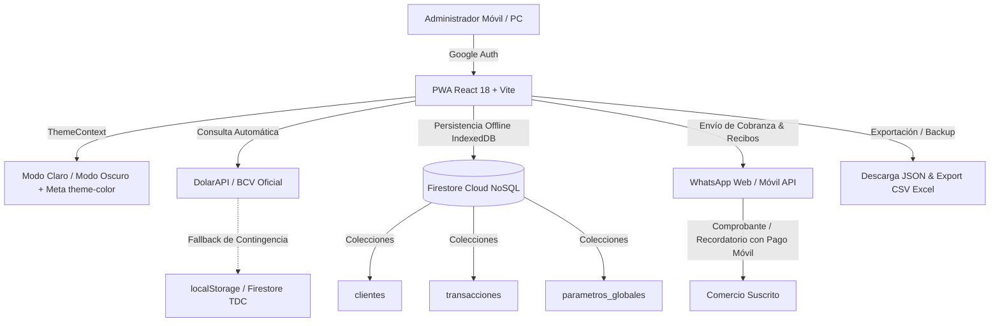

<div align="center">

# 💼 CRM Multi-Suscripciones (PWA)
### Control Inteligente de Cobranzas Recurrentes a Negocios Locales

[](https://react.dev/)
[](https://vitejs.dev/)
[](https://tailwindcss.com/)
[](https://firebase.google.com/)
[](https://crm-multisuscriptores.web.app)
[](https://crm-multisuscriptores.web.app)
[](LICENSE)

<p align="center">
  <b>Suite administrativa móvil y de escritorio (Admin-Only) para supervisar clientes, automatizar cobranzas en Bolívares (tasa oficial BCV) y USD, gestionar recibos digitales por WhatsApp y proyectar ingresos de comercios suscritos en Venezuela.</b>
</p>

[🌐 Ver Aplicación en Producción](https://crm-multisuscriptores.web.app) • [🔥 Consola Firebase](https://console.firebase.google.com/project/crm-multisuscriptores/overview) • [👨‍💻 Desarrollador](https://oman-vasquez.web.app)

---

</div>

## 📖 Tabla de Contenidos
- [Visión General](#-visión-general)
- [Arquitectura del Sistema](#-arquitectura-del-sistema)
- [Características Principales](#-características-principales)
  - [1. Dashboard Financiero en Tiempo Real](#1--dashboard-financiero-en-tiempo-real)
  - [2. Modo Claro / Modo Oscuro (Light & Dark Mode)](#2--modo-claro--modo-oscuro-light--dark-mode)
  - [3. Flujo Avanzado de Cobranzas y Pagos Multi-Mes](#3--flujo-avanzado-de-cobranzas-y-pagos-multi-mes)
  - [4. Edición, Ajuste y Eliminación de Cobros](#4--edición-ajuste-y-eliminación-de-cobros)
  - [5. Recibos Digitales y Notificaciones WhatsApp](#5--recibos-digitales-y-notificaciones-whatsapp)
  - [6. Integración Oficial BCV y DolarAPI](#6--integración-oficial-bcv-y-dolarapi)
  - [7. Estados de Cliente y Gestión de Suspendidos](#7--estados-de-cliente-y-gestión-de-suspendidos)
  - [8. Experiencia PWA Offline-First y Bottom Navigation](#8--experiencia-pwa-offline-first-y-bottom-navigation)
  - [9. Parámetros de Pago Móvil y Backups JSON](#9--parámetros-de-pago-móvil-y-backups-json)
- [Modelo de Datos (Firestore NoSQL)](#-modelo-de-datos-firestore-nosql)
- [Stack Tecnológico](#-stack-tecnológico)
- [Instalación y Configuración Local](#-instalación-y-configuración-local)
- [Despliegue en Firebase Hosting](#-despliegue-en-firebase-hosting)
- [Seguridad Crítica y Reglas de Firestore](#-seguridad-crítica-y-reglas-de-firestore)
- [Autor y Créditos](#-autor-y-créditos)

---

## 🎯 Visión General

El **CRM Multi-Suscripciones** es una Progressive Web App (PWA) de alto rendimiento optimizada para la realidad comercial venezolana. Su diseño ergonómico permite administrar carteras de cobro tanto desde una computadora portátil como directamente desde el smartphone en visitas de campo bajo la luz del sol.

### Principios Fundamentales:
* **Admin-Only:** Acceso restringido exclusivamente a la cuenta del administrador mediante Google Authentication.
* **Bimonetario Inteligente (USD & VES):** Las tarifas se configuran en dólares pero los cobros se calculan y desglosan al instante en Bolívares según la tasa oficial del Banco Central de Venezuela (BCV).
* **Auditoría e Integridad:** Historial completo e inmutable de pagos, con soporte de soft-delete para clientes y edición controlada de cobros para corregir errores operativos.
* **Resiliencia Operativa:** Caché persistente multi-pestaña en IndexedDB/Firestore y Service Worker v4 que permite consultar clientes y emitir cobros incluso sin conexión a internet.

---

## 🏛 Arquitectura del Sistema



---

## ✨ Características Principales

### 1. 📊 Dashboard Financiero en Tiempo Real
* **Métricas Clave (KPIs):** Monitoreo simultáneo de *Clientes Activos*, *Total Recaudado en el Mes* (en USD y Bs.), *Proyección Total Mensual* y *Tasa de Morosidad*.
* **Semáforo Financiero Visual:** Clasificación por colores de clientes *Solventes* (esmeralda), *Morosos* (rosa), *En Periodo de Prueba* (azul), *Próximos a Vencer* (ámbar) y *Suspendidos* (pizarra).
* **Barras de Progreso Interactivas:** Visualización gráfica del avance del recaudo respecto a la meta estimada del mes.

### 2. ☀️/🌙 Modo Claro / Modo Oscuro (Light & Dark Mode)
* **Conmutación Instantánea:** Selector de Sol / Luna disponible tanto en el encabezado de escritorio como en la barra de navegación inferior móvil.
* **Cero Parpadeo (Anti-FOUC):** Detección temprana en `<head>` que previene pantallas blancas o cambios de color indeseados durante el arranque.
* **Persistencia Total:** Recuerda la preferencia en `localStorage` (`crm_theme`) con detección inicial de la preferencia del sistema operativo (`prefers-color-scheme`).
* **Sincronización de Barra de Navegación del Celular:** Actualiza dinámicamente la metaetiqueta `theme-color` (`#ffffff` en claro, `#090d16` en oscuro) para integrarse con la barra de estado de Android y iOS.
* **Feedback Háptico:** Emite micro-vibraciones en teléfonos compatibles al alternar el modo.

### 3. 💳 Flujo Avanzado de Cobranzas y Pagos Multi-Mes
* **Cálculo en 1 Clic:** Conversión inmediata entre tarifa USD y Bolívares usando la tasa oficial del día.
* **Soporte de Pagos Adelantados Multi-Mes:** Selector flexible para registrar pagos de **1 mes, 2 meses, 3 meses, 6 meses o 12 meses** en un solo movimiento.
* **Cálculo de Fechas Preciso:** Añade exactamente los meses cancelados a la fecha de vencimiento (`fecha_proximo_pago`) sin desfases de días.
* **Métodos de Pago Soportados:** Pago Móvil, Efectivo USD, Efectivo VES, Transferencia Bancaria y Zelle.

### 4. ✏️ Edición, Ajuste y Eliminación de Cobros
* **Cajón de Auditoría Histórica:** Vista detallada de todos los pagos registrados con buscador en vivo y filtros por método de pago.
* **Edición de Cobros:** Permite modificar monto USD, tasa BCV, monto VES, método y fecha de cualquier transacción histórica si hubo un error tipográfico.
* **Anulación y Eliminación Segura:** Permite eliminar cobros duplicados o erróneos con modal de confirmación y advertencias de seguridad.

### 5. 🧾 Recibos Digitales y Notificaciones WhatsApp
* **Pantalla de Éxito de Cobro:** Tras registrar un pago, la aplicación despliega un comprobante digital limpio con el número de transacción y resumen detallado.
* **Emisión de Recibo por WhatsApp en 1 Clic:** Genera un mensaje formateado y profesional listo para enviar al cliente:
  ```text
  🧾 *COMPROBANTE DE PAGO*
  ━━━━━━━━━━━━━━━━━━━━━━
  *Negocio:* Comercial Los Ángeles
  *Software:* BodegasPro
  *Fecha:* 22/09/2026, 04:30 PM
  *N° Comprobante:* #TRX-177439
  *Periodo cubierto:* 2 meses
  ━━━━━━━━━━━━━━━━━━━━━━
  *Tarifa USD:* $10.00
  *Tasa BCV:* 52.40 Bs/$
  *Monto Abonado:* 524.00 Bs
  *Método de Pago:* Pago Móvil
  ━━━━━━━━━━━━━━━━━━━━━━
  ✅ *Próximo Vencimiento:* 22/11/2026

  ¡Muchas gracias por su puntualidad y confianza!
  ```
* **Recordatorio de Pago Pendiente:** Para clientes morosos o próximos a vencer, genera el recordatorio automático con monto exacto en Bs. y los datos bancarios del administrador.

### 6. 💵 Integración Oficial BCV y DolarAPI
* **Sincronización Automática:** Conexión con `GET https://ve.dolarapi.com/v1/dolares/oficial`.
* **Caché Híbrido:** Si la conexión falla en la calle, rescata la última tasa guardada en Firestore o en `localStorage`.
* **Modal de Ajuste Manual:** Permite cambiar la tasa de cambio manualmente con un clic en caso de actualizaciones vespertinas del BCV o caída de API externa.

### 7. 🏷️ Estados de Cliente y Gestión de Suspendidos
* **Pestaña de Suspendidos:** Área dedicada para archivar temporalmente negocios cerrados o pausados sin eliminarlos de la base de datos, con botón de **Reactivación Inmediata**.
* **Periodos de Prueba (Trial):** Registro de nuevos comercios en fase de prueba (7, 15 o 30 días gratuitos) con indicador de días restantes.
* **Filtros Dinámicos por Aplicación:** Selector que agrupa clientes según la plataforma contratada (`BodegasPro`, `GymControl`, etc.) generado automáticamente desde la base de datos.

### 8. 📱 Experiencia PWA Offline-First y Bottom Navigation
* **Barra de Navegación Inferior Móvil (BottomNav):** Controles ergonómicos al alcance del pulgar en smartphones:
  - 🏠 **Inicio:** Vista general y listado.
  - 💳 **Cobranzas:** Acceso rápido al cajón de auditoría.
  - ➕ **Nuevo:** Modal de alta de clientes.
  - 💵 **Tasa BCV:** Ajuste y consulta de tasa.
  - ☀️/🌙 **Tema:** Conmutador rápido de modo claro/oscuro.
* **Persistencia Firestore Offline:** Configuración avanzada de caché local con `persistentLocalCache` y `persistentMultipleTabManager` para consultar y registrar cobros aun sin internet.
* **Service Worker v4:** Estrategia *Network-First* para navegación y *Cache-First* para recursos estáticos versionados, garantizando arranque instantáneo y eliminando errores de pantalla en blanco.

### 9. ⚙️ Parámetros de Pago Móvil y Backups JSON
* **Configuración Dinámica de Datos Bancarios:** Modal para actualizar en cualquier momento el Banco, Cédula/RIF, Teléfono de Pago Móvil y Titular sin tocar código, guardados en Firestore (`parametros_globales/datos_pago`).
* **Descarga de Backup Completo:** Botón de respaldo en 1 clic que descarga toda la base de datos (clientes, transacciones y parámetros) en un archivo JSON estructurado con timestamp.

---

## 🗄️ Modelo de Datos (Firestore NoSQL)

### 📌 Colección: `clientes`
| Campo | Tipo | Descripción |
| :--- | :--- | :--- |
| `nombre_negocio` | `String` | Nombre comercial del local o establecimiento |
| `app_suscrita` | `String` | Nombre del software contratado (ej. BodegasPro) |
| `encargado` | `String` | Nombre y apellido del dueño o contacto principal |
| `cedula` | `String` | C.I. o RIF del cliente |
| `telefono` | `String` | Teléfono internacional normalizado (`584124169949`) |
| `direccion` | `String` | Dirección física, local o punto de referencia |
| `estado_region` | `String` | Estado o ciudad (ej. Cojedes - Tinaquillo) |
| `tarifa_base_usd` | `Number` | Mensualidad fijada en USD (ej. 5.00) |
| `fecha_inicio_contrato`| `Timestamp` | Fecha de alta del servicio |
| `fecha_proximo_pago` | `Timestamp` | Fecha límite del corte actual |
| `fecha_ultimo_pago` | `Timestamp` | Fecha del último cobro registrado |
| `es_prueba` | `Boolean` | Indica si el cliente está en periodo de prueba gratuito |
| `dias_prueba` | `Number` | Duración del periodo de prueba |
| `estado_pago` | `Boolean` | `true` = Solvente, `false` = Moroso |
| `activo` | `Boolean` | Control de estado activo o suspendido |

### 📌 Colección: `transacciones`
| Campo | Tipo | Descripción |
| :--- | :--- | :--- |
| `id_cliente` | `String` | ID del cliente en Firestore |
| `nombre_negocio` | `String` | Nombre del negocio desnormalizado para consultas rápidas |
| `fecha_pago` | `Timestamp` | Fecha y hora exacta de la transacción |
| `monto_usd_base` | `Number` | Monto pagado en USD |
| `tasa_bcv_aplicada` | `Number` | Tasa oficial BCV aplicada en el cobro |
| `monto_ves_cobrado` | `Number` | Total percibido en Bolívares |
| `metodo_pago` | `String` | Pago Móvil, Efectivo USD, Efectivo VES, etc. |
| `meses_pagados` | `Number` | Cantidad de meses cubiertos en la transacción |
| `fecha_vencimiento_anterior` | `Timestamp` | Registro del vencimiento antes del pago |
| `fecha_vencimiento_nueva` | `Timestamp` | Nuevo vencimiento calculado |

### 📌 Colección: `parametros_globales`
* **Documento `tdc`:** `{ valor_bcv: 52.40, fecha_actualizacion: Timestamp, fuente: "DolarAPI" }`
* **Documento `datos_pago`:** `{ banco: "0102 - Banco de Venezuela", cedula: "19.888.063", telefono: "04124169949", titular: "Oman Vásquez" }`

---

## 🛠️ Stack Tecnológico

| Capa | Tecnología | Propósito |
| :--- | :--- | :--- |
| **Frontend** | React 18 + Vite 5 | SPA moderna, modular y ultrarrápida |
| **Estilos** | Tailwind CSS 3.4 | Sistema de diseño responsivo con Modo Claro/Oscuro nativo |
| **Iconografía** | Lucide React | Iconografía vectorial interactiva y accesible |
| **Backend & Base de Datos** | Cloud Firestore | Base de datos NoSQL reactiva en tiempo real con persistencia offline |
| **Autenticación** | Firebase Auth | Inicio de sesión seguro con Google restringido a correo de admin |
| **Hosting** | Firebase Hosting | CDN global de alta disponibilidad con compresión Brotli y SSL |
| **PWA & Caché** | Service Worker v4 + Web Manifest | Instalación móvil sin tiendas, caché offline y sincronización |

---

## 🚀 Instalación y Configuración Local

### Prerrequisitos
* **Node.js:** v18.0 o superior (recomendado Node.js 20 LTS).
* **Firebase CLI:** Instalado globalmente (`npm install -g firebase-tools`).

### Pasos:

1. **Clonar el repositorio:**
   ```bash
   git clone git@github.com:omanvasquez/crm-multisuscriptores.git
   cd crm-multisuscriptores
   ```

2. **Instalar dependencias:**
   ```bash
   npm install
   ```

3. **Configurar variables de entorno:**
   Copia el archivo de plantilla `.env.example` y define tus credenciales de Firebase:
   ```bash
   cp .env.example .env
   ```

   Variables requeridas en `.env`:
   ```env
   VITE_FIREBASE_API_KEY=tu_api_key
   VITE_FIREBASE_AUTH_DOMAIN=crm-multisuscriptores.firebaseapp.com
   VITE_FIREBASE_PROJECT_ID=crm-multisuscriptores
   VITE_FIREBASE_STORAGE_BUCKET=crm-multisuscriptores.firebasestorage.app
   VITE_FIREBASE_MESSAGING_SENDER_ID=tu_messaging_sender_id
   VITE_FIREBASE_APP_ID=tu_app_id
   ```

4. **Ejecutar en modo de desarrollo:**
   ```bash
   npm run dev
   ```
   Ingresa a [http://localhost:5173](http://localhost:5173) en tu navegador.

5. **Compilar para producción:**
   ```bash
   npm run build
   ```

---

## 🌐 Despliegue en Firebase Hosting

Para compilar y publicar los últimos cambios a producción:

```bash
# 1. Compilación de bundles optimizados
npm run build

# 2. Despliegue a Firebase Hosting
firebase deploy --only hosting

# O despliegue completo incluyendo reglas de Firestore:
firebase deploy
```

---

## 🔒 Seguridad Crítica y Reglas de Firestore

Para proteger la información financiera y la privacidad de los clientes, la base de datos está totalmente bloqueada para el público y restringida a la cuenta autorizada:

```javascript
// firestore.rules
rules_version = '2';
service cloud.firestore {
  match /databases/{database}/documents {
    match /{document=**} {
      allow read, write: if request.auth != null && 
        request.auth.token.email in ["omanjrvasquez@gmail.com", "omanpago@gmail.com"];
    }
  }
}
```

---

## 👨‍💻 Autor y Créditos

<div align="center">

Desarrollado y mantenido con dedicación por **Oman Vásquez**

[](https://oman-vasquez.web.app)
[](https://github.com/omanvasquez)

*© 2026 Oman Vásquez. Todos los derechos reservados.*

</div>
